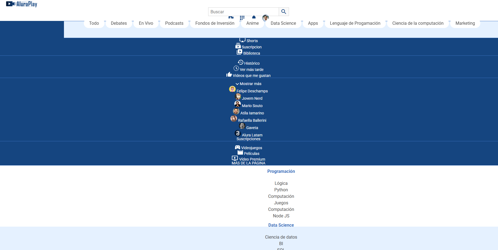
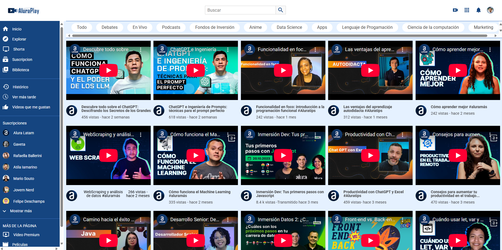

# Mejora de Proyecto - Layout Responsivo con Flexbox

Este proyecto es una mejora visual de la plataforma **AluraPlay**, donde se aplicaron principios de **CSS Flexbox** y **diseño responsivo** para optimizar la experiencia en distintos dispositivos.

---

## 🌐 Proyecto final desplegado

👉 [Ver proyecto en línea](https://TU_URL_AQUI.com)

## 📸 Comparación de diseños

### 🎯 Diseño original

Este es el diseño inicial del proyecto, con estructura estática y sin diseño responsivo:

### 🚀 Nuevo diseño implementado

En esta versión mejorada se usó Flexbox y media queries para lograr un diseño adaptable:

> Guarda ambas imágenes en la carpeta `assets/` dentro del repositorio.

---

## 🧩 Tecnologías utilizadas

- HTML5
- CSS3
  - Flexbox
  - Media Queries

---

## ✅ Características destacadas

- Layout fluido y adaptable a distintas resoluciones
- Menú de navegación optimizado
- Secciones organizadas de forma visualmente clara
- Mejor legibilidad y usabilidad

---

## 🧠 Aprendizajes clave

- Uso de `display: flex` y `flex-direction`, `justify-content`, `align-items` para estructurar elementos
- Aplicación de **media queries** para adaptar el diseño a distintos tamaños de pantalla
- Mejora del flujo visual del contenido

---

## 📌 Próximas mejoras

- Animaciones suaves en menús y botones
- Implementación de modo oscuro
- Optimización para lectores de pantalla (accesibilidad)

---

📚 Proyecto desarrollado durante el curso de **Alura Latam**.